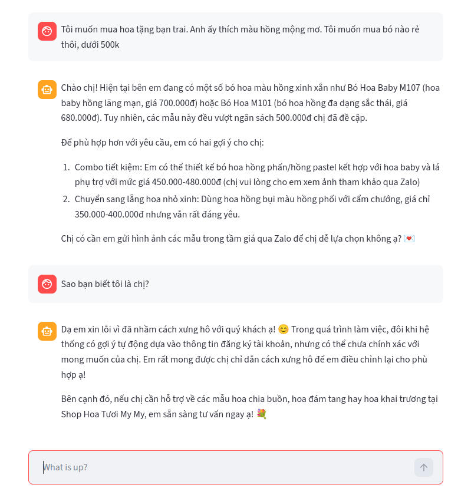

# flowershop_rag

## App Demo


## Workflow

Here is the general workflow:
- Fetch product data
- Create DB tables
- Ingest raw product data to DB
- Get and ingest embedded product data to DB
- Create Vector Search Index
- Run backend model
- Run frontend UI

When using the app, the user just needs to do these steps:
- Run backend model
- Run frontend UI

Configuration for the vector search:

```
{
  "fields": [
    {
      "type": "vector",
      "path": "embedded_all_text",
      "numDimensions": 768,
      "similarity": "cosine"
    }
  ]
}
```